```mermaid
gantt
title Learning C lanuage process🌰

dateFormat MM-DD

section Types_Calculations_Expressions
項目啓動 :done,des1,03-09,7d
項目計劃 :done,des2,after des1,6d
需求分析 :done,des3,after des2,9d
軟件設計 :done,des4,after des3,12d
軟件編碼 :crit,active,des5,04-07,20d
軟件測試 :des6,04-14,15d
項目交付 :des7,after des6,4d
```

# Learning-C lanuage
## Start up

- Types; Calculations; Expressions
  - [x] Basic
  - [X] Advance

- Logic expression
  - [x] Basic
  - [x] Advance 

- Array

- Structures

- Function

- Pointer

```

gantt
title Learning C lanuage process
dateFormat MM-DD

section Types
Basic:2023-01-18,7d

```

