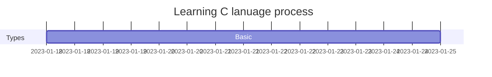
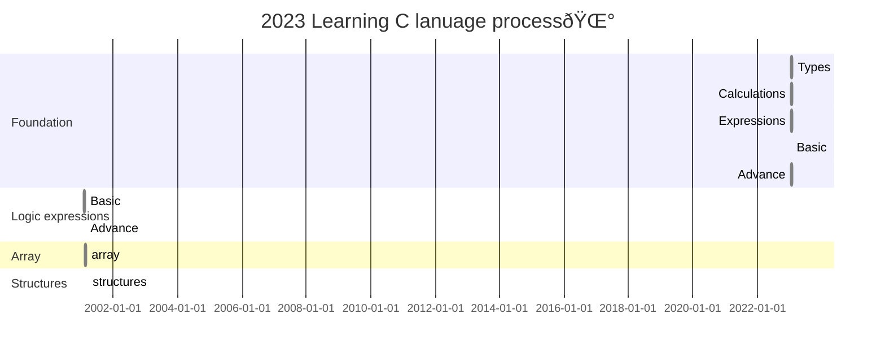

# Learning-C lanuage
## Start up

- Types; Calculations; Expressions
  - [x] Basic
  - [X] Advance

- Logic expression
  - [x] Basic
  - [x] Advance 

- Array

- Structures

- Function

- Pointer

```mermaid

gantt
title Learning C lanuage process
dateFormat MM-DD

section Types
Basic:2023-01-18,7d

```

```mermaid
gantt
title 2023 Learning C lanuage process🌰
%%dateFormat yyyy-mm-dd
section Foundation          
        Types        :done,2023-01-18,14d
        Calculations :done,2023-01-18,14d
        Expressions  :done,2023-01-18,14d
        Basic   :done,2023-01-18,7d
        Advance :done,2023-01-25,7d

section Logic expressions
        Basic   :done,des1,02-01,7d
        Advance :done,des2,after des1,7d

section Array
        array :done,02-15,7d

section Structures
        structures :done,03-08,7d

```
