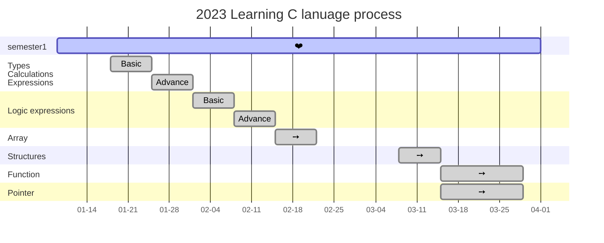

# Learning-C lanuage
## Outline

- Types; Calculations; Expressions ✅
  - Basic
  - Advance
- Logic expression ✅
  - Basic
  - Advance 
- Array ✅
- Structures ✅
- Function ✅
- Pointer ✅

## Gantt Chart

